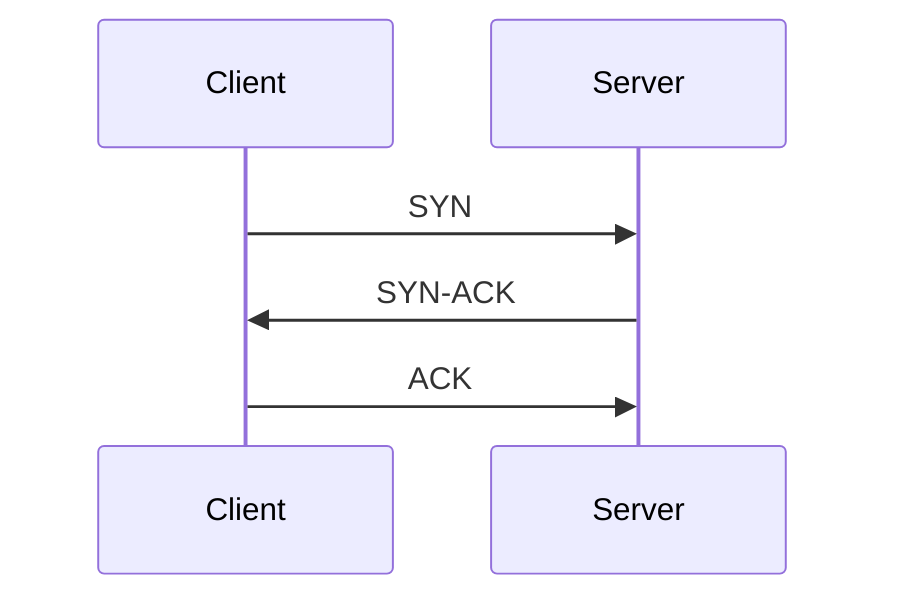
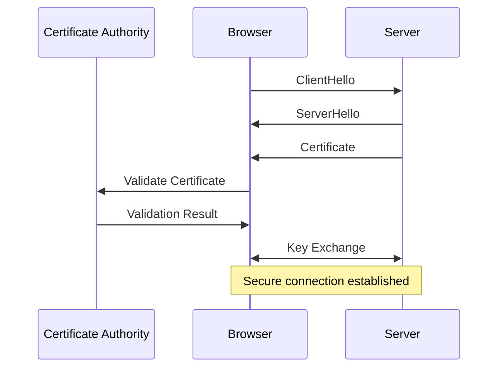

# 2. Live exercise

## "You type `google.com` and press Enter. Then what?"

---
layout: center
---

# How does this work?

## (no laptops. just shout it out.)

<VClicks>

- We will build the answer **together** on the board.
- There is no single right answer — but there are a lot of layers.
- Goal: surface every step from keystroke to rendered pixels.

</VClicks>

<!--
Facilitation notes:
- Let the room throw out steps. Capture on the board.
- Push back gently when something is hand-waved ("the internet does it") and ask "but how?".
- Target ~6–8 layers. Then walk through the slides to fill gaps.
-->

---

# DNS resolution (the bit we care about most today)

<VClicks>

- DNS translates `www.google.com` into an IP address.
- Your browser asks a resolver. The resolver asks others. Eventually somebody **authoritative** answers.
- Caching at every layer. TTLs decide for how long.

</VClicks>

---

# Where do names come from? Registrars.

<VClicks>

- You don't own a domain — you **lease** it from a registrar (Namecheap, Cloudflare, GoDaddy, Porkbun).
- The registrar talks to the registry that runs the TLD (Verisign for `.com`, PIR for `.org`, etc.).
- When you register a name, you tell the registry **which nameservers (NS records)** are authoritative for your domain.
- From then on, the whole internet asks *those* nameservers when somebody types your name.

</VClicks>

---

# What lives on a nameserver: record types

<VClicks>

- **A** — domain → IPv4 address
- **AAAA** — domain → IPv6 address
- **CNAME** — alias from one name to another
- **NS** — which nameservers are authoritative
- **MX** — where to send email for this domain
- **TXT** — arbitrary text, used for SPF, DKIM, domain verification
- **SRV** — service location for specific ports/protocols
- All of these are just key-value entries, plus a TTL telling the world how long it can cache the answer.

</VClicks>

---

# Why HTTPS?

<VClicks>

- Plain HTTP is **readable by anyone on the path** — your ISP, the coffee shop wifi, every router in between.
- HTTPS = HTTP wrapped in **TLS**, an encryption layer.
- Two problems TLS solves at once:
  - **Confidentiality** — nobody between you and the server can read the payload.
  - **Authenticity** — you know you're actually talking to `google.com`, not someone pretending.
- Under the hood: **public-key cryptography** for the initial handshake (RSA, ECDSA, **Diffie–Hellman** key exchange), then a fast symmetric cipher for the bulk traffic.
- You don't need to know the math today. You do need to know it's not optional.

</VClicks>

---

# HTTPS / TLS in one slide

<VClicks>

- HTTPS = HTTP over TLS.
- The server presents a **certificate**; your browser checks it against trusted CAs (Certificate Authorities).
- Key exchange establishes a shared secret. From here on, encrypted.
- This is why we will care about **certificates** later when we put a domain on our server.

</VClicks>

---

# TCP/IP — addressing and routing

<VClicks>

- **TCP** ensures reliable, in-order delivery. **IP** handles addressing and getting packets across networks.
- **Addressing**: every device on a network gets an IP. There aren't enough IPv4 addresses for everyone — they get reused, NATed, and tracked.
- **Routing**: the path your packets take is decided hop-by-hop, distributed, fault-tolerant. Networks reroute around outages automatically. (Sometimes the undersea cables actually do break.)

</VClicks>

---
layout: center
---



#### TCP handshake — the three-way greeting

<VClicks>

- **SYN** — client says "I want to talk".
- **SYN-ACK** — server says "OK, I'm ready, are you?".
- **ACK** — client says "Yes, go". Connection open.

</VClicks>

---
layout: center
---



#### TLS handshake — the longer, paranoid version

---

# Now we can finally make a request

```http
GET / HTTP/1.1
Host: www.google.com
User-Agent: Mozilla/5.0 (Windows NT 10.0; Win64; x64) AppleWebKit/537.36
Accept: text/html,application/xhtml+xml,application/xml;q=0.9
Accept-Language: en-US,en;q=0.5
Accept-Encoding: gzip, deflate, br
Connection: keep-alive
```

<VClicks>

- That's an HTTP request. Method, path, headers, optional body.
- Headers tell the server who you are, what you accept, what language you prefer.

</VClicks>

---

# What happens on the server side

<VClicks>

- **Load balancer** — your request usually hits one of these first. Distributes traffic across many app servers so no single one drowns.
- **App server selection** — the LB picks a healthy server, possibly one near you, possibly one with spare capacity.
- **Routing** — the chosen server's code decides what to do with `GET /`. Often: check a cache, render a page, return it.
- **Cache** — if the homepage was just sent to someone else, a copy is probably sitting in memory. Sub-millisecond response.
- The server sends back HTML, plus a status code (200, hopefully).

</VClicks>

---

# Then the browser renders

<VClicks>

- The browser parses the HTML and builds the **DOM** (Document Object Model).
- It discovers references to CSS, JavaScript, images — and fires off requests for each. Each may walk this whole chain again.
- CSS is applied; layout is computed; pixels are painted.
- JavaScript runs. Async, deferred, or blocking depending on how it's loaded.
- Modern frontends do a lot more work after the first paint: hydration, lazy loading, prefetching the next page.
- Your eyes see a Google logo. Done.

</VClicks>
