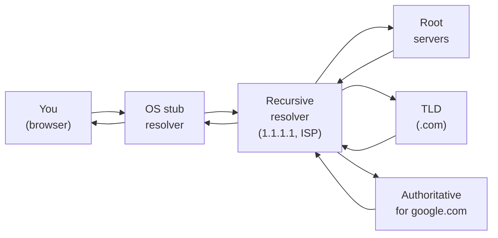
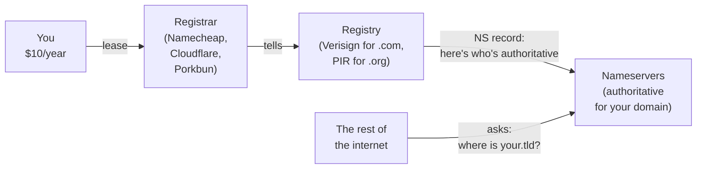
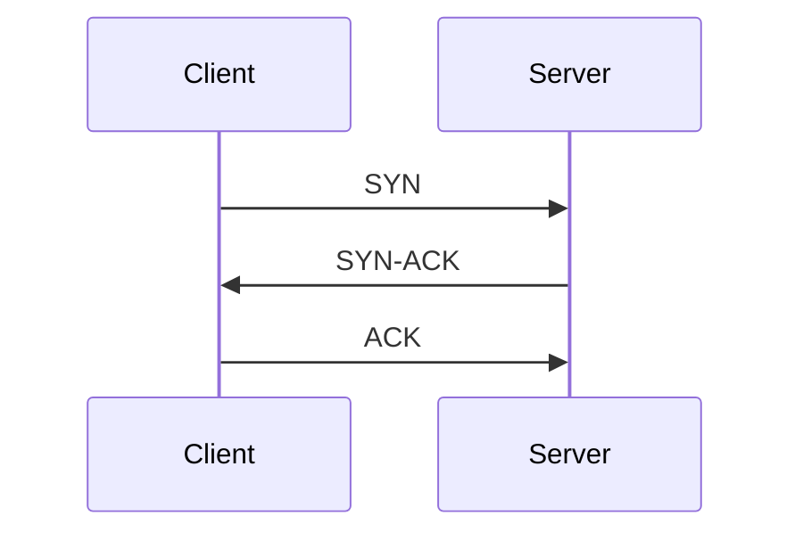
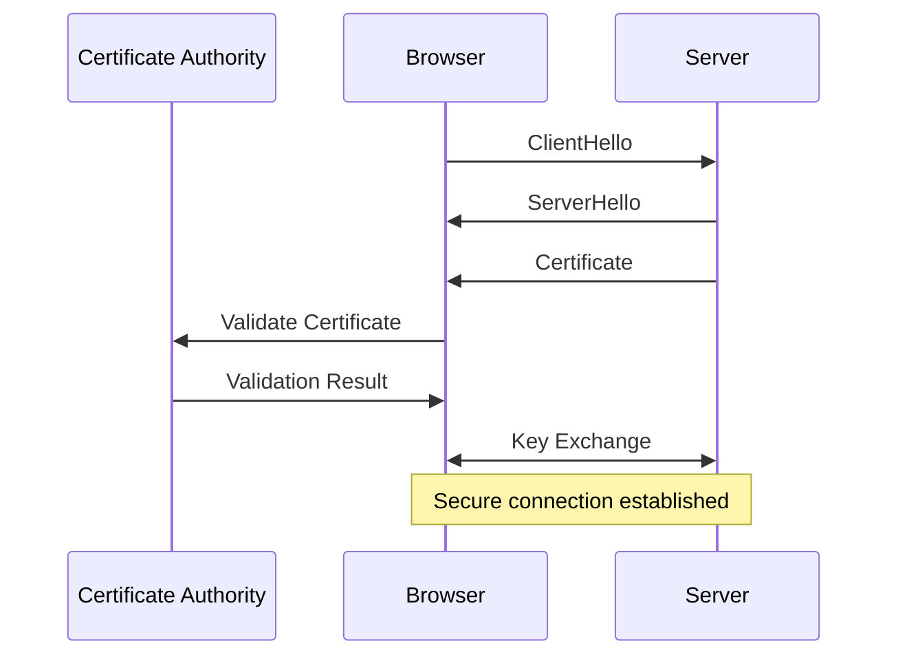
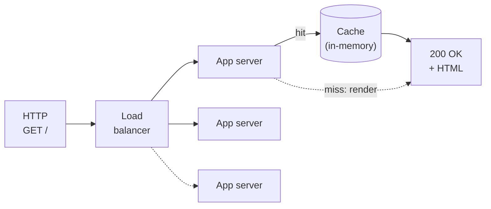
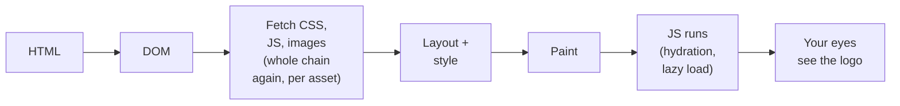

# 2. Live exercise

## "You type `google.com` and press Enter. Then what?"

---
layout: center
---

# How does this work?

## (no laptops. just shout it out.)

<VClicks>

- We will build the answer **together** on the board.
- There is no single right answer — but there are a lot of layers.
- Goal: surface every step from keystroke to rendered pixels.

</VClicks>

<!--
Facilitation notes:
- Let the room throw out steps. Capture on the board.
- Push back gently when something is hand-waved ("the internet does it") and ask "but how?".
- Target ~6–8 layers. Then walk through the slides to fill gaps.
-->

---

# DNS resolution



<div class="mt-4 text-sm">Every layer caches. TTL says how long it can hold on.</div>

---

# Where do names come from? Registrars.



---

# What lives on a nameserver: record types

<div class="grid grid-cols-4 gap-3 mt-4 text-sm">

<div class="rounded border border-yellow-500/30 p-3">

#### A
domain → IPv4
`93.184.215.14`

</div>

<div class="rounded border border-yellow-500/30 p-3">

#### AAAA
domain → IPv6
`2606:2800::1`

</div>

<div class="rounded border border-yellow-500/30 p-3">

#### CNAME
alias to another name
`www → example.com`

</div>

<div class="rounded border border-yellow-500/30 p-3">

#### NS
authoritative servers
`ns1.cloudflare.com`

</div>

<div class="rounded border border-yellow-500/30 p-3">

#### MX
mail server
`10 mail.example.com`

</div>

<div class="rounded border border-yellow-500/30 p-3">

#### TXT
arbitrary text
`v=spf1 ...` / DKIM / verification

</div>

<div class="rounded border border-yellow-500/30 p-3">

#### SRV
service + port
`_minecraft._tcp 25565`

</div>

<div class="rounded border border-yellow-500/30 p-3 bg-yellow-500/5">

#### TTL
applies to all of them — how long the rest of the internet can cache the answer

</div>

</div>

---

# HTTPS = confidentiality + authenticity

<div class="grid grid-cols-2 gap-6 mt-4">

<div>

### Confidentiality
Nobody on the path can read the payload. Not your ISP, not the coffee-shop wifi, not the routers in between.

</div>

<div>

### Authenticity
You're actually talking to `google.com`. The server proved it with a **certificate** signed by a CA your browser trusts.

</div>

</div>

<div class="mt-6 text-sm opacity-80">

Under the hood: public-key cryptography for the handshake (RSA, ECDSA, **Diffie–Hellman**), then a fast symmetric cipher for the bulk traffic. The diagram next has the steps.

</div>

---

# TCP/IP — addressing and routing

<VClicks>

- **TCP** ensures reliable, in-order delivery. **IP** handles addressing and getting packets across networks.
- **Addressing**: every device on a network gets an IP. There aren't enough IPv4 addresses for everyone — they get reused, NATed, and tracked.
- **Routing**: the path your packets take is decided hop-by-hop, distributed, fault-tolerant. Networks reroute around outages automatically. (Sometimes the undersea cables actually do break.)

</VClicks>

---
layout: center
---



#### TCP handshake — the three-way greeting

<VClicks>

- **SYN** — client says "I want to talk".
- **SYN-ACK** — server says "OK, I'm ready, are you?".
- **ACK** — client says "Yes, go". Connection open.

</VClicks>

---
layout: center
---



#### TLS handshake — the longer, paranoid version

---

# Now we can finally make a request

```http
GET / HTTP/1.1
Host: www.google.com
User-Agent: Mozilla/5.0 (Windows NT 10.0; Win64; x64) AppleWebKit/537.36
Accept: text/html,application/xhtml+xml,application/xml;q=0.9
Accept-Language: en-US,en;q=0.5
Accept-Encoding: gzip, deflate, br
Connection: keep-alive
```

<VClicks>

- That's an HTTP request. Method, path, headers, optional body.
- Headers tell the server who you are, what you accept, what language you prefer.

</VClicks>

---

# What happens on the server side



<div class="mt-4 text-sm opacity-80">Most "fast" websites are fast because of the cache. A miss is several orders of magnitude slower than a hit.</div>

---

# Then the browser renders



<div class="mt-4 text-sm opacity-80">Each image, stylesheet, and script triggers its own DNS → TCP → TLS → HTTP round. Modern sites issue dozens in parallel.</div>
