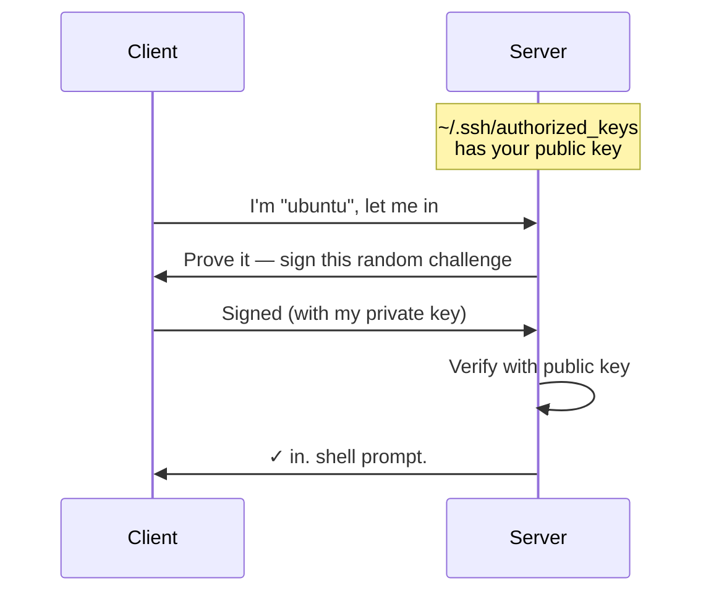

# 5. Terraform

### Describe your infrastructure. Let the tool build it.

---
layout: center
---

# Infrastructure as Code

<VClicks>

- Manage infrastructure using **code files**, not console clicks.
- **Declarative**: you describe the desired state; the tool figures out how to get there.
- Benefits:
  - **Repeatability** — same result every time
  - **Version control** — diffs, review, rollback
  - **Automation** — bring environments up and down on demand

</VClicks>

<!-- Reused from devops-workshop/day1/5terraform.md -->

---

# What does Terraform actually look like?

```hcl
provider "aws" {
  region = "eu-west-1"
}

resource "aws_instance" "web" {
  ami           = "ami-0c55b159cbfafe1f0"
  instance_type = "t3.micro"

  tags = {
    Name = "my-first-server"
  }
}
```

<VClicks>

- This is **HCL** — HashiCorp Configuration Language. Looks a bit like JSON, reads like English.
- Three lines say "I want an EC2 instance of this size, from this image, with this tag."
- Run `terraform apply`, and it exists.

</VClicks>

---
layout: center
---

# Introducing Terraform

<VClicks>

- HashiCorp tool. Written in **HCL** (HashiCorp Configuration Language).
- Works with many providers: AWS, Azure, GCP, Cloudflare, Docker, Namecheap, you name it.
- **Not open-source anymore.** In 2023 HashiCorp moved it to the BUSL license. Source-available, but not OSS.
- **OpenTofu** is the community fork — fully open-source, drop-in compatible. If the licensing matters to you, use it instead.
- Either way, ubiquitous in production.

</VClicks>

---

# Installing

<div class="grid grid-cols-3 gap-4 mt-6 text-sm">

<div>

#### macOS

```bash
brew install terraform
```

</div>

<div>

#### Linux / WSL

```bash
sudo snap install \
  terraform --classic
```

</div>

<div>

#### Windows (native)

```powershell
choco install terraform
```

Or download the `.exe` from terraform.io.

</div>

</div>

<VClicks>

- Verify with `terraform -version`. You should see `Terraform v1.x.x`.

</VClicks>

---

# How a Terraform file is structured

```hcl {1|2|3-4|5-7|all}
BLOCK_TYPE "label_a" "label_b" {
  key       = value
  other_key = "string"
  nested {
    key = value
  }
}
```

<v-clicks>

- A Terraform file is a list of **blocks**.
- Each block has a **type** (the first word).
- One or more **labels** (the quoted strings).
- And a **body** — key/value pairs, sometimes other nested blocks.
- Different block types mean different things. Let's look at the main ones.

</v-clicks>

---

# Block: `terraform` and `provider`

<div class="grid grid-cols-2 gap-6 mt-4 text-sm">

<div>

```hcl
terraform {
  required_providers {
    aws = {
      source  = "hashicorp/aws"
      version = "~> 5.0"
    }
  }
}
```

**`terraform`** — settings for Terraform itself: which providers it needs, where state lives.

</div>

<div>

```hcl
provider "aws" {
  region = "eu-west-1"
}
```

**`provider`** — configures a specific provider (AWS, Cloudflare, GCP, …) for use in this file.

</div>

</div>

---

# Block: `resource` and `data`

<div class="grid grid-cols-2 gap-6 mt-4 text-sm">

<div>

```hcl
resource "aws_instance" "web" {
  ami           = "ami-0c55..."
  instance_type = "t3.micro"
}
```

**`resource`** — something Terraform should **create and manage**. The bread and butter.

</div>

<div>

```hcl
data "aws_ami" "ubuntu" {
  most_recent = true
  owners      = ["099720109477"]
}
```

**`data`** — something that already exists and Terraform should **look up** (an AMI, a VPC, an account ID).

</div>

</div>

---

# Block: `variable` and `output`

<div class="grid grid-cols-2 gap-6 mt-4 text-sm">

<div>

```hcl
variable "instance_type" {
  description = "EC2 size"
  type        = string
  default     = "t3.micro"
}
```

**`variable`** — input to your configuration. Like function parameters.

</div>

<div>

```hcl
output "public_ip" {
  value = aws_instance.web.public_ip
}
```

**`output`** — values printed after `apply`. Like function return values.

</div>

</div>

<div class="mt-6 text-sm opacity-80">
There are more block types (<code>module</code>, <code>locals</code>, <code>terraform</code>'s <code>backend</code>) — these are the ones you'll touch every day.
</div>

---

# The workflow (memorize this)

<div class="flex items-center justify-center gap-2 mt-6 mb-4 text-yellow-400 font-mono text-sm">
  <span>init</span><span>→</span>
  <span>plan</span><span>→</span>
  <span>apply</span><span>→</span>
  <span>(iterate)</span><span>→</span>
  <span>destroy</span>
</div>

<div class="grid grid-cols-4 gap-3 mt-4 text-sm">

<div class="rounded border border-yellow-500/30 p-3">

#### `init`
Download providers, set up backend. Run once per project.

</div>

<div class="rounded border border-yellow-500/30 p-3">

#### `plan`
Show me what would change. Never destructive.

</div>

<div class="rounded border border-yellow-500/30 p-3">

#### `apply`
Actually do it. Asks for confirmation unless `-auto-approve`.

</div>

<div class="rounded border border-yellow-500/30 p-3">

#### `destroy`
Undo everything in state. Asks once. Say yes only when you mean it.

</div>

</div>

---

# terraform init

```bash
$ terraform init

Initializing the backend...
Initializing provider plugins...
- Installing hashicorp/aws v5.6.2...

Terraform has been successfully initialized!
```

<VClicks>

- Reads your `.tf` files.
- Downloads the providers you reference.
- Sets up where state will live.

</VClicks>

---

# terraform plan

```hcl
  # aws_instance.web will be created
  + resource "aws_instance" "web" {
      + ami           = "ami-0c55b159cbfafe1f0"
      + instance_type = "t3.micro"
      + tags          = { "Name" = "RegretBoard" }
    }

Plan: 1 to add, 0 to change, 0 to destroy.
```

<VClicks>

- The single most useful command in Terraform.
- **Read every plan**. Surprises are bugs.

</VClicks>

---

# terraform apply

````md magic-move
```hcl
Plan: 1 to add, 0 to change, 0 to destroy.

Do you want to perform these actions?
  Enter a value:
```
```hcl
  Enter a value: yes

aws_instance.web: Creating...
aws_instance.web: Creation complete after 15s [id=i-0abcd1234efgh5678]

Apply complete! Resources: 1 added.
```
````

<!-- Reused from devops-workshop/day1/5terraform.md -->

---
layout: statement
---

# `destroy` undoes everything.

### Asks once. Say `yes` only when you mean it. We'll run this at the end. Religiously.

---
layout: center
---

# Hands-on: your first EC2 via Terraform

### We'll build it one block at a time.

---

# Detour: SSH keys

### Before we touch Terraform, generate a key pair:

```bash
ssh-keygen -t ed25519
```

<div class="grid grid-cols-2 gap-6 mt-6">

<div class="rounded border border-red-500/40 p-4">

### 🔒 Private key
`~/.ssh/id_ed25519`

Stays on your laptop. **Never share.** Anyone with this is you.

</div>

<div class="rounded border border-yellow-500/30 p-4">

### 📤 Public key
`~/.ssh/id_ed25519.pub`

Safe to copy anywhere. Servers store it to recognize you.

</div>

</div>

---
layout: center
---

# How SSH key auth works



<div class="mt-4 text-sm opacity-80">Private key never leaves your laptop. Today, <strong>Terraform handles "put the public key in authorized_keys" via <code>aws_key_pair</code></strong>.</div>

---

# Step 1 — Tell Terraform where to store its state

```hcl
terraform {
  backend "local" {
    path = "terraform.tfstate"
  }
}
```

<VClicks>

- The **state file** is Terraform's memory of what it created.
- Lose it and Terraform has no idea anything exists.
- We use local state today (the file lives next to your `.tf` files).
- Production teams use S3 + DynamoDB locks instead. Same idea, shared.

</VClicks>

---

# Step 2 — Pick a provider

```hcl
provider "aws" {
  region = "eu-west-1"
}
```

<VClicks>

- "We're going to be talking to AWS. In `eu-west-1` (Ireland)."
- Credentials come from your `aws configure` setup automatically.

</VClicks>

---

# Step 3 — How do we get into the box? `aws_key_pair`

```hcl
resource "random_pet" "student_id" {
  length = 2
}

resource "aws_key_pair" "student_key" {
  key_name   = "student-${random_pet.student_id.id}"
  public_key = var.student_public_key
}
```

<VClicks>

- **`aws_key_pair`** uploads your public key to AWS so any instance you launch can recognize you.
- The `random_pet` resource gives each student a unique nickname like `cheerful-otter` — AWS hates name collisions with 20 of you in one account.
- This is how it goes: **resources can reference each other**, and Terraform figures out the order.

</VClicks>

---

# Step 4a — Who's allowed in? `aws_security_group`

```hcl
resource "aws_security_group" "student_sg" {
  name = "student-sg-${random_pet.student_id.id}"

  ingress {
    description = "SSH"
    from_port   = 22
    to_port     = 22
    protocol    = "tcp"
    cidr_blocks = ["0.0.0.0/0"]
  }
}
```

<VClicks>

- Security groups are AWS's firewall. **`ingress`** whitelists inbound, **`egress`** whitelists outbound. Everything not listed is denied.
- This skeleton opens port 22 from anywhere so you can SSH in. Fine for a workshop — for production you'd restrict to a known IP or bastion.

</VClicks>

---

# Step 4b — Open the game ports

<div class="text-xs">

```hcl
# ...inside the same aws_security_group block

  ingress {
    description = "Minecraft"
    from_port   = 25565
    to_port     = 25565
    protocol    = "tcp"
    cidr_blocks = ["0.0.0.0/0"]
  }

  ingress {
    description = "BlueMap HTTP"
    from_port   = 8100
    to_port     = 8100
    protocol    = "tcp"
    cidr_blocks = ["0.0.0.0/0"]
  }

  egress {
    from_port   = 0
    to_port     = 0
    protocol    = "-1"   # all protocols
    cidr_blocks = ["0.0.0.0/0"]
  }
```

</div>

<VClicks>

- Two more `ingress` rules: **25565** for the Minecraft client, **8100** for the BlueMap web view.
- One `egress` letting the box reach the whole internet — required so `apt-get` and `wget` work during provisioning.

</VClicks>

---

# Step 5 — What operating system? `aws_ami`

```hcl
data "aws_ami" "ubuntu" {
  most_recent = true
  owners      = ["099720109477"]   # Canonical (Ubuntu)

  filter {
    name   = "name"
    values = ["ubuntu/images/hvm-ssd/ubuntu-jammy-22.04-amd64-server-*"]
  }

  filter {
    name   = "architecture"
    values = ["x86_64"]
  }
}
```

<VClicks>

- An **AMI** (Amazon Machine Image) is a disk image to boot the machine from. That's it. A snapshot of an OS + whatever was preinstalled.
- We're looking up the latest official Ubuntu 22.04 AMI, instead of hardcoding an ID that goes stale.

</VClicks>

---

# Step 6 — What hardware? `aws_instance`

```hcl
resource "aws_instance" "student_instance" {
  ami                         = data.aws_ami.ubuntu.id
  instance_type               = var.instance_type
  key_name                    = aws_key_pair.student_key.key_name
  vpc_security_group_ids      = [aws_security_group.student_sg.id]
  associate_public_ip_address = true

  tags = {
    Name    = "student-${random_pet.student_id.id}"
    Purpose = "DevOpsWorkshop"
    Owner   = "student-${random_pet.student_id.id}"
  }
}
```

<VClicks>

- The actual virtual machine. Notice how it **references** the previous resources by name.
- `t3.small` is small but enough RAM for Minecraft. `t3.micro` would OOM.

</VClicks>

---

# Step 7 — Parameters: `variable`

```hcl
variable "student_public_key" {
  description = "Your SSH public key contents"
  type        = string
}
```

```hcl
# tf.vars
student_public_key = "ssh-ed25519 AAAAC3NzaC1lZDI1NTE5AAAA..."
```

```bash
terraform apply --var-file=tf.vars
```

<VClicks>

- Hardcoding `file("~/.ssh/id_ed25519.pub")` is fine for one person; **variables** let the same config work for 20 different students.
- Variables become inputs to your config — like function parameters.
- `tf.vars` is a file you don't commit, holding the values that change per user.

</VClicks>

---

# Step 8 — How do I get the IP back? `output`

```hcl {maxHeight:'320px'}
output "instance_public_ip" {
  value = aws_instance.student_instance.public_ip
}

output "ssh_command" {
  value = "ssh ubuntu@${aws_instance.student_instance.public_ip}"
}

output "minecraft_address" {
  value = "${aws_instance.student_instance.public_ip}:25565"
}

output "bluemap_url" {
  value = "http://${aws_instance.student_instance.public_ip}:8100"
}
```

<VClicks>

- After `apply`, Terraform prints the outputs. Or fetch them later with `terraform output ssh_command`.
- This is the magic moment. You typed code. AWS made a computer. Terraform tells you how to reach it.

</VClicks>

---

# Create your `terraform.tfvars`

### One file, two lines. Don't commit it.

```hcl
# terraform.tfvars
student_public_key   = "ssh-ed25519 AAAAC3NzaC1... your-name"
ssh_private_key_path = "~/.ssh/id_ed25519"
```

<VClicks>

- Get the public key contents with `cat ~/.ssh/id_ed25519.pub` and paste the whole line.
- The file is named `terraform.tfvars` so Terraform auto-loads it. No `--var-file` flag needed.
- Already in `.gitignore` — your private bits never go to the repo.

</VClicks>

---
layout: center
---

# 🚀 `terraform apply`

### Go. See what happens.
