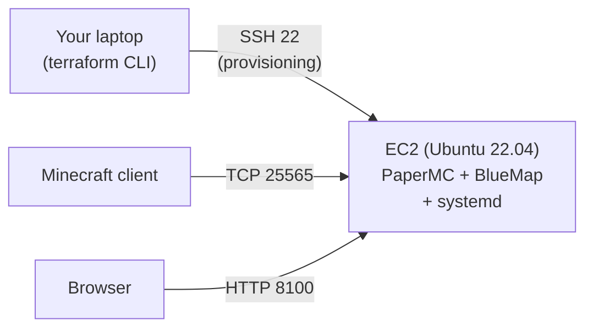

# 6. Provisioning: Minecraft + BlueMap

---

# We have a server. What does that mean?

<VClicks>

- A real, running Linux machine sitting in an AWS datacenter in Ireland.
- It has a public IP. It accepts SSH on port 22 (we opened that in the security group).
- It knows about your public key (we uploaded that via `aws_key_pair`).
- Which means: we can log into it right now, from your laptop, as if it were on your desk.

</VClicks>

---

# Let's SSH in

```bash
# Easiest — Terraform printed the command for you
terraform output -raw ssh_command | bash

# Or do it by hand
ssh ubuntu@$(terraform output -raw instance_public_ip)
```

<VClicks>

- First time, SSH asks "are you sure?" — yes, you are.
- You should see something like `ubuntu@ip-10-0-1-23:~$`. You are inside the EC2.
- The shell looks exactly like a normal Ubuntu terminal because **it is one**. There's no magic; it's just a remote computer.

</VClicks>

---

# You're in. A quick terminal tour

```bash
pwd                # where am I?           /home/ubuntu
ls -la             # what's here?
whoami             # who am I?             ubuntu
uname -a           # what OS am I on?      Linux ... Ubuntu 22.04 ...
cat /etc/os-release
df -h              # disk usage
free -h            # memory
top                # processes (q to quit)
sudo apt update    # run something as root
exit               # back to your laptop
```

<VClicks>

- These are the same commands you'd type on a Linux laptop. Nothing about it being remote changes the shell.
- `sudo` runs a command as root — needed to install software.
- `exit` (or Ctrl+D) drops you back on your own machine.

</VClicks>

---

# Could we install Minecraft by hand from here?

<VClicks>

- Absolutely. SSH in, `apt install java`, download the server JAR, run it.
- For 1 server, that's fine. For 20 students all doing it slightly differently, with no record of what was done — that's not fine.
- We want it **scripted, repeatable, and re-runnable**. Same input, same output.
- That's what provisioning means.

</VClicks>

---

# What we actually need to install

<VClicks>

- **Java 21** — the Minecraft server is a Java program. Ubuntu doesn't ship with it.
- **The server JAR** — we'll use **PaperMC** (a Spigot-compatible server, faster and easier to distribute).
- **EULA acceptance** — Mojang requires you to `echo eula=true > eula.txt` before the server will boot.
- **The BlueMap plugin JAR** — dropped into a `plugins/` folder; serves a 3D web map on port 8100.
- **A way to keep it running** — if we just launch it, it dies when SSH disconnects. We need a **systemd service**.

</VClicks>

---

# Step by step: the install script

```bash {maxHeight:'320px'}
# Add 2GB swap — t3.small has only 2GB RAM, Java + apt outrun it.
if [ ! -f /swapfile ]; then
  sudo fallocate -l 2G /swapfile && sudo chmod 600 /swapfile
  sudo mkswap /swapfile && sudo swapon /swapfile
fi

# Java 21
sudo apt-get update -y
sudo apt-get install -y openjdk-21-jre-headless wget

# A home for the server
sudo mkdir -p /opt/minecraft/plugins/BlueMap
sudo chown -R ubuntu:ubuntu /opt/minecraft

# Download server + plugin
wget -qO /opt/minecraft/server.jar       "<PAPERMC_URL>"
wget -qO /opt/minecraft/plugins/BlueMap.jar "<BLUEMAP_URL>"

# Pre-accept BlueMap asset download
echo 'accept-download: true' > /opt/minecraft/plugins/BlueMap/core.conf

# EULA + offline mode
echo 'eula=true' > /opt/minecraft/eula.txt
```

<VClicks>

- Nothing exotic — `apt`, `wget`, a couple of files.
- The two new lines that matter: **swap** (so the OS survives Java spikes) and **BlueMap's `accept-download: true`** (or the plugin refuses to render).

</VClicks>

---

# Wrapping it in a systemd service

```ini
[Unit]
Description=Minecraft Server (PaperMC + BlueMap)
After=network.target

[Service]
User=ubuntu
WorkingDirectory=/opt/minecraft
ExecStart=/usr/bin/java -Xmx1024M -Xms1024M -jar /opt/minecraft/server.jar nogui
Restart=on-failure
RestartSec=10

[Install]
WantedBy=multi-user.target
```

<VClicks>

- Write to `/etc/systemd/system/minecraft.service`, then `daemon-reload && enable && restart`.
- Server starts at boot, restarts on crash, runs detached from any shell.
- This is how Linux runs every long-lived service: ssh, nginx, postgres, your app.

</VClicks>

---

# Now: do all that, from Terraform

<VClicks>

- We have a recipe. ~10 shell commands plus a systemd unit.
- Running them by hand on 20 servers is exactly the toil we've been trying to avoid.
- Terraform has a mechanism for this: provisioners attached to a resource.
- We'll wrap our recipe in a `null_resource` so it runs once the EC2 exists, and **re-runs cleanly** when we want to iterate.

</VClicks>

---

# `null_resource` and provisioners

<VClicks>

- A `null_resource` is a Terraform resource that does nothing on its own.
- But it has **provisioners** — `remote-exec`, `local-exec`, `file` — that run commands.
- With `depends_on`, you tie it to the EC2 so it runs **after** the box exists.
- With `triggers`, you tell Terraform when to re-run it.

</VClicks>

---

# The install resource

```hcl {maxHeight:'380px'}
resource "null_resource" "minecraft_install" {
  depends_on = [aws_instance.student_instance]

  triggers = {
    instance_id    = aws_instance.student_instance.id
    install_script = filemd5("${path.module}/install.sh")
    systemd_unit   = filemd5("${path.module}/minecraft.service")
  }

  connection {
    type        = "ssh"
    user        = "ubuntu"
    host        = aws_instance.student_instance.public_ip
    private_key = file(pathexpand(var.ssh_private_key_path))
  }

  provisioner "file" {
    source      = "${path.module}/install.sh"
    destination = "/tmp/install.sh"
  }

  provisioner "file" {
    source      = "${path.module}/minecraft.service"
    destination = "/tmp/minecraft.service"
  }

  provisioner "remote-exec" {
    inline = ["bash /tmp/install.sh"]
  }
}
```

<VClicks>

- Two `file` provisioners copy the script + systemd unit to the box.
- One `remote-exec` line runs `bash /tmp/install.sh`. That's it.
- HCL stays small; the recipe lives in real shell, separately testable.

</VClicks>

---

# The dependency story

<VClicks>

- `depends_on = [aws_instance.student_instance]` — wait for the box.
- `triggers = { instance_id = ... }` — if the instance is **replaced**, re-run the install.
- This is the killer feature: replace the machine, and the install re-runs automatically. No drift.

</VClicks>

---

# Try it: break it on purpose

<VClicks>

- `terraform apply -replace=aws_instance.student_instance`
- Terraform destroys and recreates the instance.
- Because `null_resource.minecraft_install` depends on `instance_id`, it **also** reruns.
- One command, fully rebuilt server.
- (Older docs use `terraform taint` — same idea, now deprecated in favour of `-replace`.)

</VClicks>

---

# Or just rerun the install

<VClicks>

- Don't want a new machine, just a fresh install? Tweak the script and:
  ```bash
  terraform apply -replace=null_resource.minecraft_install
  ```
- Same EC2, same IP, same security group. New Minecraft.
- This is the thing `user_data` cannot do.

</VClicks>

---

# Why not `user_data`?

<VClicks>

- EC2 has a `user_data` field — a script the box runs once, on first boot. Looks simpler:
  ```hcl
  resource "aws_instance" "student_instance" {
    user_data = file("${path.module}/install.sh")
  }
  ```
- It's a fine pattern. A lot of production code uses it. But for **today** we deliberately chose `null_resource` instead.

</VClicks>

---

# The case for `null_resource`

<div class="grid grid-cols-2 gap-6 mt-4">

<div>

### `user_data`

- Runs on the box, **errors invisible** to Terraform
- Errors land in `/var/log/cloud-init-output.log`
- **Runs once.** Change the script → replace the instance
- Simpler, but opaque

</div>

<div>

### `null_resource` + `remote-exec`

- Runs in Terraform's foreground — **every error surfaces**
- Re-runnable: `terraform apply -replace=null_resource.minecraft_install`
- Same box, fresh install. Iteration is fast
- More moving parts, but you see what's happening

</div>

</div>

---
layout: center
---

# 🚀 Connect to the server

```
Minecraft → Multiplayer → Add Server → <your-public-ip>:25565
```

## And open BlueMap

```
http://<your-public-ip>:8100
```

---

# What we just did — the whole stack



<VClicks>

- One Terraform stack on your laptop produced everything on the right.
- The recipe is in `install.sh`; the systemd unit keeps it alive.
- Replace the instance → install re-runs. Edit the script → install re-runs. No drift.

</VClicks>

---

# When it breaks (and it will)

```bash
# Did terraform actually see what I changed?
terraform plan

# What did terraform print for the IP / URLs?
terraform output

# Can I SSH at all?
ssh -v ubuntu@$(terraform output -raw instance_public_ip)

# Once on the box: is the service up? logs?
sudo systemctl status minecraft
sudo journalctl -u minecraft -f

# Re-run just the install, keep the box
terraform apply -replace=null_resource.minecraft_install
```

<VClicks>

- `terraform plan` first — never assume. Surprises in plan are bugs in your head.
- `ssh -v` shows you exactly where the connection fails (auth, network, key).
- `journalctl -f` tails the server log live — watch world generation, watch crashes.

</VClicks>
